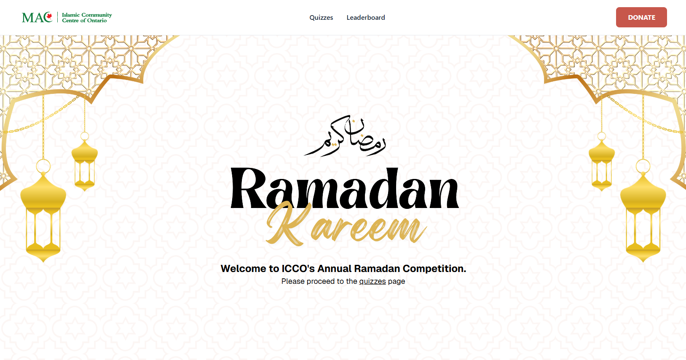

## What is ICCO Reflect? ⭐

ICCO Reflect is the annual trivia competition hosted by the Islamic Community Centre of Ontario (ICCO) to **2500+ centre attendees**, in Mississauga, Canada. As the centre was experiencing a bottleneck in how many players they could manually manage the data for, I built this website end-to-end to create a **scalable** and **seamless** user experience.   Built in NextJS, the website uses Google Sheets as its primary CMS, where all the user data is scored for each quiz. This design decision was made in favour of **scalability** and **ease of use**, as opposed to building a entire user auth system from the ground up (like the one I built for [Reality Quest](https://github.com/HBehery/realityquest) using NextAuth), along with a quiz microservice.  Feel free to visit the website at https://iccoramadanreflect.ca/!

## Rules/Logistics 📋

By navigating to the quizzes section on the website, you will be taken to a portal for each trivia quiz of the day while the compeitition ran. Additionally, you can also visit the leaderboard where the top 10 players from each round are displayed (note that past winners from each round were not considered for standings in the following rounds).

## Analytics: 140 Total Unique Players Registered, ~4000 page visits 📈

